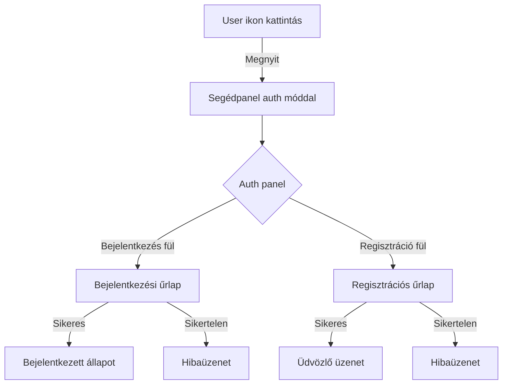

# Auth rendszer részletes terv

## 1. Felhasználói élmény (UX) folyamat



kell több bejelenkezési forma. gmail facebbok stb... szerintem móst jól működik. terv a további fejlesztéshez.

milyen fájlok kellenek? valós regíztráció nélkül hogy tudjuk hogy a bejelenkezés után átáll segédpanelre?

...........................................

# Közösségi bejelentkezés implementációs terv

A már működő alapvető bejelentkezési rendszert könnyen bővíthetjük közösségi bejelentkezési lehetőségekkel. Íme a részletes terv:

## 1. Szükséges fájlok és módosítások

### Új komponensek:

- `SocialLogin.tsx` - Közösségi bejelentkezési gombok komponense
- `SocialLogin.module.css` - Közösségi gombok stílusai

### Módosítandó fájlok:

- `Auth.tsx` - Közösségi bejelentkezés integrálása
- `Auth.module.css` - Stílusok kiegészítése

## 2. Közösségi bejelentkezés komponens

```typescript
import * as React from 'react';
import styles from './SocialLogin.module.css';

interface SocialLoginProps {
  onSuccess?: () => void;
}

export const SocialLogin: React.FC<SocialLoginProps> = ({ onSuccess }) => {
  const handleSocialLogin = (provider: string) => {
    console.log(`Bejelentkezés ${provider} használatával...`);

    // Itt valós környezetben az OAuth folyamatot indítanánk el

    // Demó céljából szimulálunk egy sikeres bejelentkezést
    setTimeout(() => {
      console.log(`Sikeres bejelentkezés ${provider} fiókkal`);
      onSuccess?.();
    }, 1500);
  };

  return (
    <div className={styles.socialLoginContainer}>
      <p className={styles.socialText}>Vagy jelentkezz be egyszerűen:</p>

      <div className={styles.socialButtons}>
        <button
          className={`${styles.socialButton} ${styles.google}`}
          onClick={() => handleSocialLogin('Google')}
        >
          <span className={styles.socialIcon}>G</span>
          Google
        </button>

        <button
          className={`${styles.socialButton} ${styles.facebook}`}
          onClick={() => handleSocialLogin('Facebook')}
        >
          <span className={styles.socialIcon}>f</span>
          Facebook
        </button>

        <button
          className={`${styles.socialButton} ${styles.apple}`}
          onClick={() => handleSocialLogin('Apple')}
        >
          <span className={styles.socialIcon}>🍎</span>
          Apple
        </button>
      </div>
    </div>
  );
};
```

## 3. Stílusok a közösségi bejelentkezéshez

```css
.socialLoginContainer {
  margin-top: 1.5rem;
  display: flex;
  flex-direction: column;
  gap: 0.5rem;
}

.socialText {
  text-align: center;
  font-size: 0.9rem;
  color: var(--color-text-secondary);
  margin-bottom: 0.5rem;
}

.socialButtons {
  display: flex;
  flex-direction: column;
  gap: 0.75rem;
}

.socialButton {
  display: flex;
  align-items: center;
  justify-content: center;
  gap: 0.5rem;
  padding: 0.5rem;
  border-radius: 4px;
  border: none;
  font-weight: 500;
  cursor: pointer;
  transition: all 0.2s ease;
}

.socialButton:hover {
  opacity: 0.9;
}

.socialIcon {
  display: flex;
  align-items: center;
  justify-content: center;
  width: 24px;
  height: 24px;
  font-size: 1rem;
  font-weight: bold;
}

.google {
  background-color: white;
  color: #444;
  border: 1px solid #ddd;
}

.facebook {
  background-color: #3b5998;
  color: white;
}

.apple {
  background-color: #000;
  color: white;
}

/* Reszponzív igazítások */
@media (min-width: 480px) {
  .socialButtons {
    flex-direction: row;
  }

  .socialButton {
    flex: 1;
  }
}
```

## 4. Auth komponens módosítása

```typescript
import { SocialLogin } from './SocialLogin';

// ...existing code...

export const Auth: React.FC<AuthProps> = ({ onClose, onLoginSuccess, onRegisterSuccess }) => {
  // ...existing code...

  return (
    <div className={styles.authContent}>
      {/* ...existing tabs and forms... */}

      {activeTab === 'login' && (
        <>
          <form className={styles.authForm} onSubmit={handleLoginSubmit}>
            {/* ...existing form fields... */}
          </form>

          <div className={styles.separator}>
            <span>vagy</span>
          </div>

          <SocialLogin onSuccess={onLoginSuccess} />
        </>
      )}

      {/* ...existing register form... */}
    </div>
  );
};
```

## 5. Auth.module.css kiegészítése

```css
.separator {
  display: flex;
  align-items: center;
  text-align: center;
  margin: 1rem 0;
}

.separator::before,
.separator::after {
  content: '';
  flex: 1;
  border-bottom: 1px solid var(--color-border);
}

.separator span {
  padding: 0 10px;
  color: var(--color-text-secondary);
  font-size: 0.9rem;
}
```

## 6. Tesztelés valós regisztráció nélkül

A valós regisztráció nélküli bejelentkezés tesztelésére:

1. **Szimuláljuk a sikeres bejelentkezést:**
   - Egy késleltetett callback-et használunk a bejelentkezés szimulálására
   - Rövid időre megjelenítünk egy "Sikeres bejelentkezés" üzenetet
   - Ezután váltunk vissza tools módra

2. **Állapotváltás ellenőrzése:**
   - Console.log üzenetek segítségével ellenőrizzük a műveleteket
   - A felhasználói felületen látható visszajelzések alapján

3. **UI visszajelzés:**
   - Betöltési állapot jelzése
   - Sikeres / sikertelen művelet jelzése
   - Átmenet a segédpanel módba

Szeretnéd látni valamelyik részt részletesebben?
